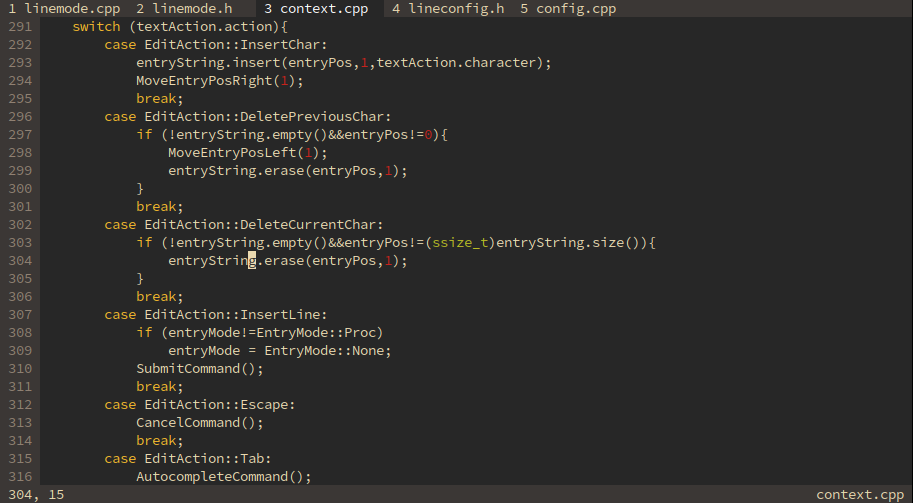

# context



context is a mode-based console text editor.


## Features

- syntax highlighting
- command-based config file format
- Windows support
- UTF-8 support
- vim-like movement keys accessible by holding Alt
- style configuration
- remappable keybinds
- help page (F1)


## Requirements

- Python 3
- ncurses (Linux)
- X11 (Linux)
- g++ 12.1.0+


## Help

Press F1 to bring up the help page and press Ctrl-q to quit.

## Installation

### Linux

```
./builder.py
sudo ./builder.py linux/install
```

This will install context at `/usr/local/bin/ctx`.

### Windows

```
python builder.py
```

MSYS2 or an equivalent build system is needed
to build context on Windows.
This command will build a portable executable of
context in `bin/ctx`.

## Configuration

context will look for a config file at `~/.ctxcfg`.
The help page explains what can be configured.
